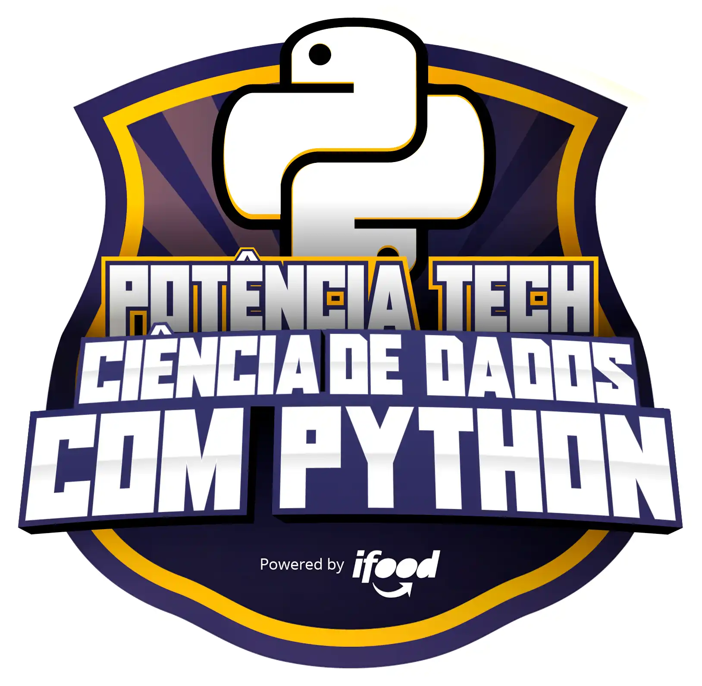

# Bootcamp DIO

# Potência Tech powered by iFood | Ciência de Dados 

Seção 01: Princípios de Desenvolvimento de Software

 

Não tem nada neste seção por se tratar somente de preparar o ambiente de trabalho.

secao02-dominando-python-ciencia-de-dados

 

- [aula01 - ](https://github.com/LucianMontibeller/bootcamp-DIO/tree/main/Pot%C3%AAncia-Tech-powered-by-iFood-Ci%C3%AAncia-de-Dados/secao02-dominando-python-ciencia-de-dados/aula01)

-  [aula02 - Exercícios](https://github.com/LucianMontibeller/bootcamp-DIO/tree/main/Pot%C3%AAncia-Tech-powered-by-iFood-Ci%C3%AAncia-de-Dados/secao02-dominando-python-ciencia-de-dados/aula02-tipos-de-operadores)

-  [aula03 - Comentários do código](https://github.com/LucianMontibeller/bootcamp-DIO/tree/main/Pot%C3%AAncia-Tech-powered-by-iFood-Ci%C3%AAncia-de-Dados/secao02-dominando-python-ciencia-de-dados/aula03-estrutura-condicional-repeticao)

-  [aula04 - Navegador vs Node(HTML + JavaScript)](https://github.com/LucianMontibeller/bootcamp-DIO/tree/main/Pot%C3%AAncia-Tech-powered-by-iFood-Ci%C3%AAncia-de-Dados/secao02-dominando-python-ciencia-de-dados/aula04-manipulando-strings)

-  [aula05 - variáveis com let](https://github.com/LucianMontibeller/bootcamp-DIO/tree/main/Pot%C3%AAncia-Tech-powered-by-iFood-Ci%C3%AAncia-de-Dados/secao02-dominando-python-ciencia-de-dados/aula05-DESAFIO-sistema-bancario)

-  [aula06 - constantes com const](https://github.com/LucianMontibeller/bootcamp-DIO/tree/main/Pot%C3%AAncia-Tech-powered-by-iFood-Ci%C3%AAncia-de-Dados/secao02-dominando-python-ciencia-de-dados/aula06-listas-python)

-  [aula07 - constantes com const](https://github.com/LucianMontibeller/bootcamp-DIO/tree/main/Pot%C3%AAncia-Tech-powered-by-iFood-Ci%C3%AAncia-de-Dados/secao02-dominando-python-ciencia-de-dados/aula08-conjuntos-python)

-  [aula08 - conjuntos-python](https://github.com/LucianMontibeller/bootcamp-DIO/tree/main/Pot%C3%AAncia-Tech-powered-by-iFood-Ci%C3%AAncia-de-Dados/secao02-dominando-python-ciencia-de-dados/aula08-conjuntos-python)

-  [aula09 - dicionarios-python](https://github.com/LucianMontibeller/bootcamp-DIO/tree/main/Pot%C3%AAncia-Tech-powered-by-iFood-Ci%C3%AAncia-de-Dados/secao02-dominando-python-ciencia-de-dados/aula09-dicionarios-python)

-  [aula10 - funcoes](https://github.com/LucianMontibeller/bootcamp-DIO/tree/main/Pot%C3%AAncia-Tech-powered-by-iFood-Ci%C3%AAncia-de-Dados/secao02-dominando-python-ciencia-de-dados/aula10-funcoes)

-  [desafio-otimizando-sistema-bancario](https://github.com/LucianMontibeller/bootcamp-DIO/tree/main/Pot%C3%AAncia-Tech-powered-by-iFood-Ci%C3%AAncia-de-Dados/secao02-dominando-python-ciencia-de-dados/desafio-otimizando-sistema-bancario)

